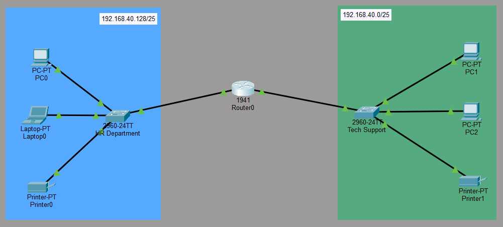

# router-switch-lan-
A two-department LAN connected via switches and a router using an IP address with full inter-network communication.

## TITLE SECTION
Project title: Inter-Departmental LAN Connectivity using routers and switches  
Author: Thato Maputla  
Date: 24 February 2026

### OVERVIEW
This project shows a network between 2 departments in a company using the network address (192.168.40.0). All the end-user devices are configured with appropriate IP addresses, subnet masks, and gateways. The departments each consist of 3 end-user devices connected through dedicated switches and a central router. This design ensures that devices within and across departments can communicate seamlessly.

### OBJECTIVES
1. Implement subnetting to create 2 departmental subnets from a single network ID
2. Configure switches to communicate within the departments.
3. Configure the router to enable communication across the network.
4. Verify connectivity between all devices through simulation tools.

### NETWORK TOPOLOGY (Extended star)
Devices used:  
- 1 Router (central interconnection point)
- 1 Laptop (for one department)
- 2 Switches (one per department)
- 2 Printers (one per department)
- 3 PCs (2 in one department, 1 in another)
		
Logical design:  
Each department is connected to its own switch. The switches are connected to the router, which routes traffic between the two subnets. 
 

 

### SUBNETTING 
Provided network: 192.168.40.0  
Number of subnets required: 2  

//formula for calculating subnets:  
//2^n = 2  
//solving for n, we get: n = 1  
//given n = 1; this will represent borrowed bits  
//11111111.11111111.11111111.10000000  
//255.255.255.128 = Subnet mask with block size of 128  

First Subnet:  
Subnet mask = 255.255.255.128  
Network ID = 192.168.40.0  
CIDR notation = 192.168.40.0/25  
Valid host range = 192.168.40.1 -> 192.168.40.126  
Broadcast ID = 192.168.40.127  

Second Subnet:  
Subnet mask = 255.255.255.128  
Network ID = 192.168.40.128  
CIDR notation = 192.168.40.128/25  
Valid host range = 192.168.40.129 -> 192.168.40.254  
Broadcast ID = 192.168.40.255  

### IP ADDRESSING SCHEME
1. HR Department (192.168.40.128/25)
- PC 0: IP address=192.168.40.130 ; Subnet mask=255.255.255.128 ; Default gateway=192.168.40.129 
- Laptop0: IP address=192.168.40.131 ; Subnet mask=255.255.255.128 ; Default gateway=192.168.40.129
- Printer0: IP address=192.168.40.132 ; Subnet mask=255.255.255.128 ; Default gateway=192.168.40.129
- Router Interface gig0/1: IP address=192.168.40.129 ; Subnet mask=255.255.255.128

2. Tech Support (192.168.40.0/25)
- PC 1: IP address=192.168.40.2 ; Subnet mask=255.255.255.128 ; Default gateway=192.168.40.1 
- PC 2: IP address=192.168.40.3 ; Subnet mask=255.255.255.128 ; Default gateway=192.168.40.1
- Printer1: IP address=192.168.40.4 ; Subnet mask=255.255.255.128 ; Default gateway=192.168.40.1
- Router Interface gig0/0: IP address=192.168.40.1 ; Subnet mask=255.255.255.128

### NETWORK CONFIGURATION 

###### HR Department (192.168.40.128/25)
- PC0: 192.168.40.130 / 255.255.255.128 / Gateway: 192.168.40.129
- Laptop0: 192.168.40.131 / 255.255.255.128 / Gateway: 192.168.40.129
- Printer0: 192.168.40.132 / 255.255.255.128 / Gateway: 192.168.40.129
- Router Gig0/1: 192.168.40.129 / 255.255.255.128

###### Tech Support (192.168.40.0/25)
- PC1: 192.168.40.2 / 255.255.255.128 / Gateway: 192.168.40.1
- PC2: 192.168.40.3 / 255.255.255.128 / Gateway: 192.168.40.1
- Printer1: 192.168.40.4 / 255.255.255.128 / Gateway: 192.168.40.1
- Router Gig0/0: 192.168.40.1 / 255.255.255.128

### IP Addressing Scheme

| Department      | Device        | IP Address       | Subnet Mask       | Default Gateway   |
|-----------------|---------------|------------------|-------------------|-------------------|
| HR Department (192.168.40.128/25) | PC0          | 192.168.40.130    | 255.255.255.128   | 192.168.40.129    |
|                 | Laptop0       | 192.168.40.131   | 255.255.255.128   | 192.168.40.129    |
|                 | Printer0      | 192.168.40.132   | 255.255.255.128   | 192.168.40.129    |
|                 | Router Gig0/1 | 192.168.40.129   | 255.255.255.128   | —                 |
| Tech Support (192.168.40.0/25)  | PC1          | 192.168.40.2      | 255.255.255.128   | 192.168.40.1      |
|                 | PC2           | 192.168.40.3     | 255.255.255.128   | 192.168.40.1      |
|                 | Printer1      | 192.168.40.4     | 255.255.255.128   | 192.168.40.1      |
|                 | Router Gig0/0 | 192.168.40.1     | 255.255.255.128   | —                 |

### CLI CONFIGURATION (sanitized)
1. Router:
   Router> en  
		Router# config t  
		Router(config)# int range gig0/0-1  
		Router(config-if-range)# no shutdown  
		Router(config-if)# do wr  
		Router(config-if)# exit  
		Router(config)# int gig0/0  
		Router(config-if)# ip address 192.168.2.1 255.255.255.128  
		Router(config-if)# int gig0/1  
		Router(config-if)# ip address 192.168.2.129 255.255.255.128  
		Router(config-if)# do wr  
		Router(config-if)# exit  

2. Switches: Default configuration sufficient for this project

3. End devices: Manually assigned IP addresses, subnet masks, and gateways.

### TESTING & VERIFICATION 
Ping tests:  
PC0 -> Laptop0 (same subnet)  
PC0 -> Printer1 (different subnet, routed via router)  
Laptop0 -> PC1 (cross-department communication)  
Results: All tests were successful, indicating communication across departments.  

#### CONCLUSION 
This project demonstrated the fundamentals of LAN design and inter-departmental communication using Cisco Packet Tracer. Key skills practiced: subnetting & IP addressing, application of CIDR notation, router configuration, application of the OSI Model, switch setup, and connectivity testing. The design can be scaled further by adding more departments, VLANs, or advanced routing protocols.

